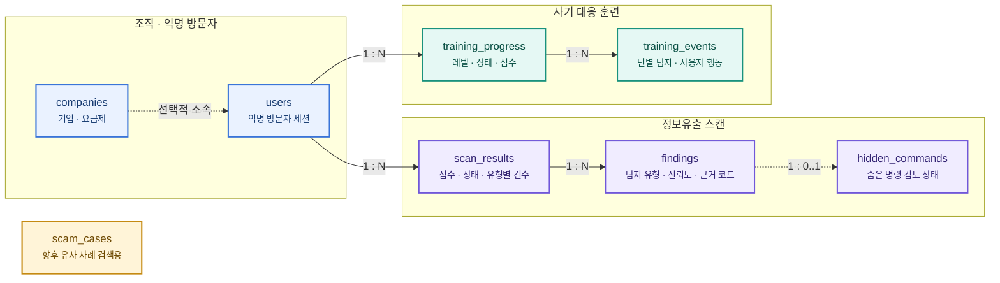
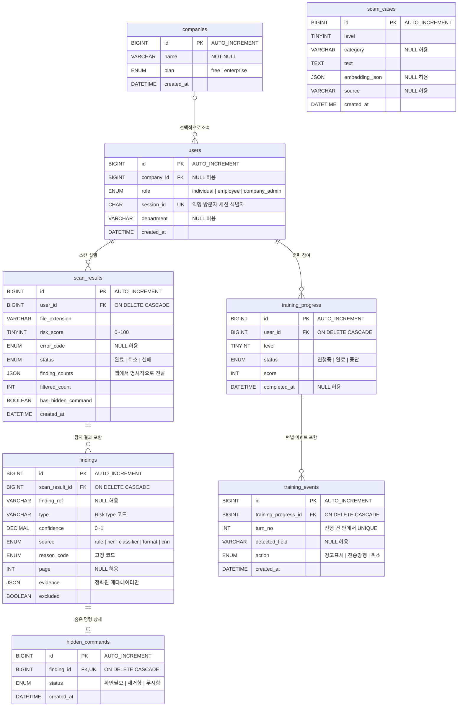

# docXray DB ERD v3

> TiDB Cloud / MySQL 호환 스키마 기준  
> 개인정보 원문을 저장하지 않고, 스캔 결과와 훈련 진행 상태만 보존하는 구조입니다.

## 1. 발표용 도메인 맵

아래 그림은 심사위원이나 비개발자에게 전체 구조를 설명할 때 사용하기 좋습니다.

## 2. 상세 ERD

## 3. 관계와 삭제 정책

| 부모 | 자식 | 관계 | 부모 삭제 시 |
|---|---|---:|---|
| `companies` | `users` | 1 : 0..N | 자동 삭제 없음. 사용자는 기업 없이도 존재 가능 |
| `users` | `scan_results` | 1 : 0..N | 스캔 결과 자동 삭제 |
| `scan_results` | `findings` | 1 : 0..N | 탐지 결과 자동 삭제 |
| `findings` | `hidden_commands` | 1 : 0..1 | 숨은 명령 상세 자동 삭제 |
| `users` | `training_progress` | 1 : 0..N | 훈련 진행 기록 자동 삭제 |
| `training_progress` | `training_events` | 1 : 0..N | 턴별 이벤트 자동 삭제 |
| 없음 | `scam_cases` | 독립 테이블 | 별도 관리 |

`hidden_commands.finding_id`에는 `UNIQUE`가 적용되어 탐지 결과 하나당 숨은 명령 상세는 최대 한 건만 존재합니다. `training_events`는 `(training_progress_id, turn_no)` 조합이 유일해야 합니다.

## 4. 설계 핵심

### 원문을 저장하지 않는 스캔 이력

- 업로드 파일과 추출 원문은 DB에 저장하지 않습니다.
- `findings.reason_code`에는 설명 문장 대신 고정 코드를 저장합니다.
- `findings.evidence`에는 허용된 메타데이터만 정화하여 저장합니다.
- `scan_results.finding_counts`에는 허용된 `RiskType`별 건수만 저장합니다.

### 세션과 권한의 경계

- `users.session_id`는 같은 브라우저의 이력과 훈련 진행을 연결하는 익명 방문자 세션 식별자입니다.
- 세션 값이 노출되면 해당 세션의 접근 자격처럼 사용될 수 있으므로 비밀번호와 같은 수준으로 보호해야 합니다.
- `company_admin` 권한은 `session_id`만으로 신뢰하지 않으며, 별도의 인증과 인가가 필요합니다.

### JSON 컬럼 처리

- TiDB Cloud/MySQL 호환성을 위해 JSON 리터럴 DB 기본값에 의존하지 않습니다.
- 애플리케이션이 `finding_counts`와 `evidence`에 항상 `dict`를 명시적으로 전달합니다.
- ORM의 `default=dict`는 flush 시 ORM이 채우는 값이며 DB의 `DEFAULT`가 아닙니다.

### 보존 기간과 CASCADE의 역할

- `ON DELETE CASCADE`는 부모가 삭제될 때 자식 레코드를 함께 정리합니다.
- 보존 기간이 지난 데이터를 자동 만료시키지는 않습니다.
- 실제 만료 삭제는 `db/retention_job.py`를 cron 또는 배포 플랫폼의 예약 작업으로 실행해야 합니다.

## 5. 발표용 설명

> docXray는 업로드 원문을 DB에 남기지 않습니다. 익명 세션을 중심으로 스캔 결과와 훈련 진행만 연결하고, 탐지 근거는 고정 코드와 정화된 메타데이터로 보존합니다. 사용자나 스캔 이력을 삭제하면 관련 상세 기록도 외래 키 CASCADE를 통해 함께 정리됩니다.

